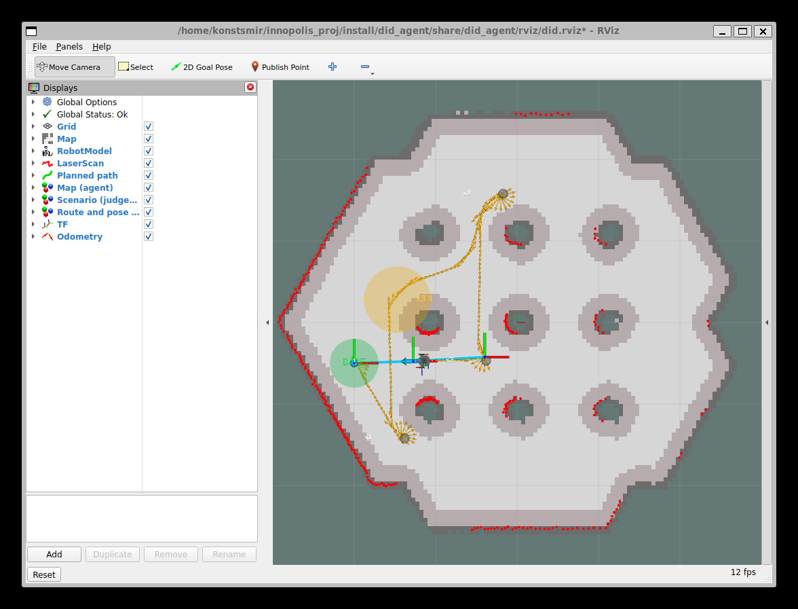

# Автономный исследователь на TurtleBot3 — DID Hack 2026

Команда **IKA**. Агент управляет TurtleBot3 Burger в Gazebo (ROS 2 Jazzy, мир `turtlebot3_world`):
строит маршрут по карте, едет к образцам, собирает их, следит за батареей и возвращается на базу.
Судья и генератор сценариев (образцы, «дорогие» грунты, опасные зоны, скрытые события) написаны нами по интерфейсу из [TASK.md](TASK.md).



## Быстрый старт

Нужны Ubuntu 24.04 (у нас — WSL2) и ROS 2 Jazzy:

```bash
sudo apt install ros-jazzy-desktop ros-jazzy-ros-gz ros-jazzy-turtlebot3 ros-jazzy-turtlebot3-simulations \
                 ros-jazzy-nav2-map-server ros-jazzy-nav2-lifecycle-manager python3-colcon-common-extensions python3-pytest
git clone https://github.com/TwoToTango123/innopolis-agent-turtle.git ~/innopolis_proj
cd ~/innopolis_proj && source /opt/ros/jazzy/setup.bash && colcon build --symlink-install
source install/setup.bash
```

## Демо — одна команда

| Что показать | Команда |
|---|---|
| **Полная миссия**: 3 образца → сбор → возврат → `/did/finish` | `ros2 launch did_agent did.launch.py scenario:=easy` |
| Миссия посложнее (5 образцов, 3 зоны грунта) | `ros2 launch did_agent did.launch.py scenario:=medium` |
| **Оператор задаёт цель / маршрут** в RViz | `ros2 launch did_agent did.launch.py planner:=manual` |
| Сценарий, сгенерированный по seed | `ros2 launch did_agent did.launch.py scenario:=hard seed:=7` |
| Остановить всё | `./scripts/stop_sim.sh` |

В режиме `planner:=manual`:
- **2D Goal Pose** (панель RViz) — ехать в точку сейчас (текущая поездка прерывается);
- **Publish Point** — добавить точку в маршрут (робот проходит их по порядку);
- цель на базе (зелёный круг) — вернуться и завершить прогон;
- то же из терминала: `./scripts/send_goal.sh 0.55 -0.55`, `./scripts/send_route.sh 0.55,0.55 -0.55,1.6`.

Флаги: `gui:=true` — окно Gazebo (в WSL на Intel Arc рисуется с артефактами, поэтому по умолчанию выключено), `rviz:=false`.
Журналы прогонов (счёт, события, траектория, журнал подцелей) пишутся в `runs/`.

## Что в RViz

Карта арены и запретная зона 0,2 м вокруг препятствий · робот, лидар, след одометрии · голубая линия — путь A* ·
пронумерованные точки маршрута · «вид судьи» (скрыт от агента): образцы (жёлтые → серые после сбора), зоны грунта с множителем, опасные зоны, база.

## Архитектура

```
             ┌──────────────── did_agent (ROS-узел, тонкая обёртка) ─────────────────┐
 /odom /imu ─┤ DeadReckoning (путь — одометрия, курс — IMU) → поза в мире, TF map→odom│
 /scan      ─┤                                                                       │
 /did/*     ─┤ Planner ──подцели──► MissionExecutor ──► Navigator ──► /cmd_vel       │
 RViz goals ─┤ scripted | manual    (бюджет батареи)    A* + follower  (TwistStamped) │
             └──────────────────────────────┬────────────────────────────────────────┘
                                  /did/collect, /did/finish
             ┌──────────────── did_judge (ROS-узел) ─────────────────────────────────┐
 Gazebo pose ┤ Judge: батарея, датчик образцов, столкновения, штрафы, скрытые события│
 (истинная)  │ Scenario: генератор easy/medium/hard по seed, YAML                     │
             └──► /did/battery /did/sample_sensor /did/score /did/events ────────────┘
```

Вся логика — в `src/did_agent/did_agent/core/` на чистом Python (numpy + pyyaml), без ROS: её можно разрабатывать и тестировать на Windows.
Узлы в `nodes/` только переводят сообщения ROS в вызовы core. Подробно — [docs/DEFENSE.md](docs/DEFENSE.md).

## Тесты и офлайн-симулятор

```bash
cd src/did_agent && python3 -m pytest -q          # 104 теста, ~25 с, ROS не нужен
python3 -m did_agent.core.offline_sim easy        # вся миссия без Gazebo за секунды
```

## Документы

- [docs/DEFENSE.md](docs/DEFENSE.md) — резюме проекта для защиты
- [DEVLOG.md](DEVLOG.md) — журнал разработки с ассистентом: что, почему, какие грабли
- [QUESTIONS.md](QUESTIONS.md) — неоднозначности задания и принятые временные решения
- [TASK.md](TASK.md) — исходное задание
